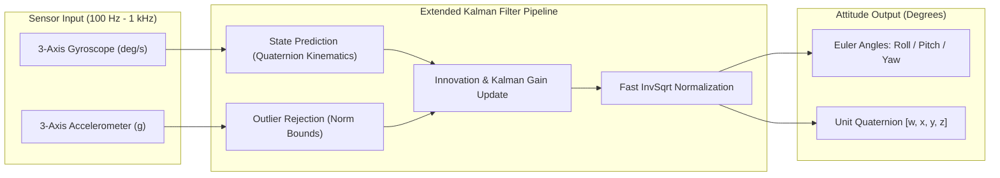

# 🧭 Embedded DSP IMU Sensor Fusion (Extended Kalman Filter)

[](https://en.wikipedia.org/wiki/C99)
[-E0234E?style=flat-square)](https://en.wikipedia.org/wiki/Extended_Kalman_filter)
[-03234C?style=flat-square&logo=stmicroelectronics&logoColor=white)](https://www.st.com/)
[](LICENSE)

A high-speed, deterministic **6-DOF / 9-DOF IMU Sensor Fusion Engine** implemented in ANSI C. Designed for real-time attitude & heading reference systems (AHRS), drones, robotics, and gimbal stabilization on **ARM Cortex-M4 (STM32F4)** microcontrollers.

---

## 🔌 Hardware Circuit Diagram & 6-DOF IMU Interface

```
                                    +3.3V Power Rail
                                          |
                      +-------------------+-------------------+
                      |                   |                   |
                  [ 4.7kΩ ]           [ 4.7kΩ ]               |
                      |                   |                  VCC
                      | (I2C SCL)         | (I2C SDA)         |
                      +---------+         +---------+         |
                                |                   |         |
 +------------------------------+-------------------+---------+-------------------+
 |                              |                   |         |                   |
 |                             PB8                 PB9       3V3                  |
 |                                                                                |
 |    [ STM32F4 / ESP32 Controller ]                                              |
 |                                                                                |
 |                             PA0                 GND                            |
 +------------------------------+-------------------+-----------------------------+
                                |                   |
                           (EXTI0_IRQ)             GND
                                |                   |
                                v                   v
 +------------------------------+-------------------+-----------------------------+
 |                             INT                 GND                            |
 |                                                                                |
 |                    [ MPU-6050 6-Axis MotionTracking IMU ]                      |
 |                                                                                |
 |            SCL                      SDA                     AD0                |
 +-------------+------------------------+-----------------------+-----------------+
               |                        |                       |
            (I2C SCL)                (I2C SDA)                 GND (Address 0x68)
```

---

## 🏛️ System Architecture & EKF Pipeline



---

## ⚡ Hardware Pinout Matrix

| IMU Pin | MCU Pin | Function | Notes |
| :--- | :--- | :--- | :--- |
| **MPU-6050 SCL** | `PB8` | I2C1 Clock | 400 kHz Fast-Mode with 4.7kΩ pull-up |
| **MPU-6050 SDA** | `PB9` | I2C1 Data | 400 kHz Fast-Mode with 4.7kΩ pull-up |
| **MPU-6050 INT** | `PA0` | Data-Ready Interrupt | EXTI0 rising edge trigger (1 kHz rate) |
| **MPU-6050 AD0** | `GND` | I2C Address Select | Low = 0x68, High = 0x69 |
| **MPU-6050 VDD** | `3V3` | Power Supply | 3.3V Regulated Rail |

---

## 🛠️ Build & Verification

```bash
# Compile using GCC
gcc -O2 -Wall -Wextra -Iinclude src/quaternion_math.c src/ekf_fusion.c src/mpu6050_dma.c src/main.c -lm -o dsp_ekf_fusion

# Run simulation
./dsp_ekf_fusion

# Run Python visualizer
python tools/attitude_visualizer.py
```

---

## 👤 Author
* **Herambeswar Mandadapu** – [@mandadapuherambeswar-ux](https://github.com/mandadapuherambeswar-ux)
* **LinkedIn:** [Herambeswar Mandadapu](https://linkedin.com/in/herambeswar-mandadapu-5a977a385)
